# Peel

Peel controls whether an `.xlsx` attachment can leave an owned mailbox. It
keeps the artifact identity, checks the workbook, asks for approval before any
Repair or Disclosure, and verifies the result before release.

## What it does

Peel runs this workflow:

1. Read one eligible draft from the owned Gmail mailbox.
2. Store the attachment behind an opaque Artifact Reference and SHA-256 hash.
3. Inspect the OOXML package for hidden worksheets and other concealed data.
4. Refuse unsupported or unprovable files. For an eligible Finding, create a
   complete Repair Plan and wait for native Repair Approval.
5. Run an approved Repair in a fresh Daytona sandbox when needed. Then verify
   either the repaired candidate or the untouched original against the
   original visible workbook.
6. Request a separate Disclosure Approval and send only the exact verified
   artifact to an allowlisted recipient.

The daemon exposes the same command contract over HTTP and MCP. Its TypeScript
process owns Run state, SQLite metadata, artifact identities, approvals,
deduplication, and delivery outcomes. TrueForge presents the workflow. A
configured `ScopeAssessor` supplies a one-way advisory result; the default
entry point refuses Findings when no assessor is available. Neither TrueForge
nor an assessor can approve a Repair or Disclosure.

## System flow

A clean scan still moves through `verify` before Disclosure. When a Finding
exists, the engine returns the Repair Plan and the `ScopeAssessor` only gates
whether Peel may present that plan for native approval.

```mermaid
flowchart LR
    subgraph Mailbox["Owned mailbox"]
        Draft["Gmail draft"] --> Watcher["MailboxWatcher<br/>IMAP bridge"]
    end

    subgraph Peel["Peel daemon"]
        Daemon["HTTP + MCP boundary"]
        Store[("SQLite Run state<br/>in-memory artifact bytes")]
        Finding{"Finding?"}
        Scanned["Scanned<br/>clean original"]
        Scope["ScopeAssessor<br/>advisory veto"]
        Plan["Repair Plan<br/>from scan"]
        PlanGate{"Scope passes<br/>and plan eligible?"}
        RepairApproval{"Repair Approval<br/>native in TrueForge"}
        RepairHeld["Denied<br/>no Repair side effect"]
        Candidate["Candidate artifact"]
        Verification{"Verification passed?"}
        Verified["Verified artifact"]
        DisclosureApproval{"Disclosure Approval<br/>native in TrueForge"}
        NoSMTP["Denied<br/>no SMTP call"]
        Refused["Refused<br/>no Disclosure"]
    end

    subgraph Sandbox["Fresh Daytona sandbox per operation"]
        Scan["Scan"]
        Repair["Repair"]
        Verify["Verify"]
    end

    subgraph Services["Connected services"]
        TrueForge["TrueForge<br/>agent session + approvals"]
        Cerebras["Cerebras<br/>optional scope advice"]
        SMTP["SMTP bridge"]
        Recipient["Owned recipient mailbox"]
        Unknown["delivery_unknown<br/>no automatic retry"]
        Failed["failed"]
    end

    Watcher -->|eligible envelope and bytes| Daemon
    Daemon --> Store
    Store --> Scan
    Scan --> Finding
    Finding -- "No" --> Scanned
    Finding -- "Yes" --> Scope
    Finding -- "Yes" --> Plan
    Scope --> PlanGate
    Plan --> PlanGate
    PlanGate -- "No" --> Refused
    PlanGate -- "Yes" --> RepairApproval
    RepairApproval -- "Deny" --> RepairHeld
    RepairApproval -- "Approve" --> Repair
    Repair --> Candidate
    Scanned --> Verify
    Candidate --> Verify
    Verify --> Verification
    Verification -- "No" --> Refused
    Verification -- "Yes" --> Verified
    Verified --> DisclosureApproval
    DisclosureApproval -- "Deny" --> NoSMTP
    NoSMTP --> Verified
    DisclosureApproval -- "Approve" --> SMTP
    SMTP -- "Accepted" --> Recipient
    SMTP -- "Ambiguous" --> Unknown
    SMTP -- "Rejected" --> Failed
    TrueForge -. "commands and bounded metadata" .-> Daemon
    TrueForge -. "native approval UI" .-> RepairApproval
    TrueForge -. "native approval UI" .-> DisclosureApproval
    Cerebras -. "advisory result" .-> Scope
```



## Why it exists

A workbook can contain data that its sender did not intend to release. A model
or a UI can explain a Finding, but it cannot prove that a Repair is safe or
authorize an email. Peel keeps those decisions in a small state machine with
bound identities and explicit human approvals.

The system fails closed. Unknown workbook features, failed Verification,
stale identities, mismatched hashes, missing scope context, and expired
approvals block progress. An ambiguous SMTP result becomes `delivery_unknown`
and Peel does not retry it automatically.

## Supported profile

The demonstrated profile is WSL2/Ubuntu and an unencrypted OOXML `.xlsx` no
larger than 10 MiB. The documented live qualification sequence covers:

- a clean workbook Disclosure through an owned Gmail draft;
- the completed Gmail Mailbox Trigger as an optional intake route; and
- native denial, fresh approval, Daytona Verification, and exact recipient
  confirmation.

The daemon and tests also cover an unreferenced hidden-worksheet Finding and
approved Repair when a ScopeAssessor returns `no_mismatch_found`.

The code and tests also contain the issue #8 hidden rows or columns and issue
#9 pivot-cache journeys. They remain outside the qualified submission profile
until they have their own end-to-end evidence. Sensitive Reveal values and
LibreOffice-dependent checks are also cuts. Reveal, when enabled, stays on the
local boundary for 60 seconds and returns at most five rows.

This profile needs no new package and no local LibreOffice install. The
existing ZIP/XML checks and optional `openpyxl` reader are the supported
verification path; findings still fail closed until a real ScopeAssessor is
configured.

Peel refuses macros, external connections, unknown content-bearing package
members, malformed packages, unsupported extensions, and any result whose
fidelity it cannot prove. It never claims that an arbitrary workbook is
globally clean.

## How the pieces fit

- `src/daemon.ts` implements the Run state machine and approval checks.
- `src/repair.ts` scans supported OOXML packages, builds Repair Plans, applies
  surgical ZIP changes, and checks relationships, content types, visible
  content, and package reopening.
- `src/http.ts` serves `/health`, `/v1/artifacts`, `/v1/commands`,
  `/v1/runs/{id}`, `/v1/runs/{id}/reveals/{reference}`, and `/mcp`.
- The MCP `send_email` tool maps to `respond_disclosure` with an approval
  decision. It still requires the exact Disclosure Approval binding, so it
  cannot create an approval or bypass the daemon's checks.
- `src/mailbox.ts` and `scripts/mailbox_fetch.py` read and deduplicate eligible
  drafts. The watcher does not scan, repair, approve, or disclose files.
- `src/adapters.ts` connects live runs to Daytona and SMTP. It also provides
  fake adapters and the default fail-closed ScopeAssessor. Production live
  mode runs scan, Repair, and Verification through the Python engine in fresh
  Daytona sandboxes and does not use the local Python workbook engine.
- `schemas/` contains the versioned daemon and engine contracts.
- `scripts/` contains the environment, mail, TrueForge, Daytona, live journey,
  privacy, and rehearsal gates.
- `tests/` covers HTTP and MCP boundaries, state transitions, mailbox behavior,
  OOXML cases, live bridges, privacy checks, and qualification rules.

## Setup

Use WSL2/Ubuntu with Node.js 22.5 or newer and Python 3.10 or newer.

```bash
npm ci
python3 -m pip install -r requirements-gate.txt
cp .env.example .env
npm run typecheck
npm run build
```

Set the local values in `.env`. The live scripts read `.env` from the
repository root. Do not commit it or put credentials, draft bodies, workbook
values, attachment bytes, or provider transcripts in the repository.

Start a local daemon with `PEEL_OWNED_RECIPIENT` set in the shell:

```bash
PEEL_OWNED_RECIPIENT=recipient@example.test npm start
```

The daemon listens on `127.0.0.1:8787` by default and stores its SQLite file
at `.peel/peel.sqlite`. Set `PEEL_LIVE_MODE=1` only for a configured live run.
Live mode requires Daytona and SMTP settings from `.env`.

## Reproduce the live journey

Keep TrueForge running at `PEEL_TRUEFORGE_URL`. The default is
`http://localhost:8790`. Prepare one owned Gmail draft with one allowlisted
recipient, one non-empty `Intended disclosure:` line, and one `.xlsx`
attachment.

Run the complete journey twice:

```bash
TMPDIR=/tmp npm run build
python3 scripts/rehearse_submission.py \
  --repo-root "$PWD" \
  --evidence-dir /tmp/peel-rehearsals \
  --evidence-file /tmp/peel-submission-evidence.json \
  --trueforge-url http://localhost:8790 \
  --model gemma-4-31b
```

The wrapper runs `scripts/live_clean_workbook.py` twice. Each run retrieves the
draft, transfers the exact attachment, uses TrueForge and Cerebras, runs scan
and Verification in fresh Daytona sandboxes, denies the first Disclosure with
zero SMTP activity, obtains fresh approval, and confirms one exact attachment
in the owned recipient mailbox. It exits successfully only when two consecutive rehearsals return `demo_ready` with unchanged code and configuration.

For individual gates, use:

```bash
python3 scripts/environment_gate.py
python3 scripts/mail_gate_probe.py
python3 scripts/trueforge_gate_probe.py --base-url http://localhost:8790
python3 scripts/daytona_gate_probe.py
```

These commands write bounded evidence. They do not print secret values or
workbook contents.

## Privacy qualification

Before declaring a submission ready, create a local ignored manifest for these
retained records: logs, SQLite, TrueForge events, Cerebras requests, MCP
transcripts, Daytona artifact metadata, and reports. Mark Daytona cleanup with
`"destroyed": true`. Keep a private corpus containing the original attachment,
known workbook values, draft body, and local credentials outside the worktree.

Run the checker with:

```bash
python3 scripts/privacy_qualification.py \
  --manifest /tmp/peel-privacy/manifest.json \
  --forbidden-file /tmp/peel-privacy/private-values.txt \
  --forbidden-file /tmp/peel-privacy/original-attachment.xlsx \
  --repo-root "$PWD" \
  --evidence-file /tmp/peel-privacy/evidence.json
```

It checks every listed record, decoded JSON and SQLite values, explicit base64
payloads, prohibited field names, Daytona cleanup, and tracked-file hygiene.
It returns bounded status only.

## Failure rules

- `failed` means an external prerequisite failed. Stop and start a new Run.
- `refused` means Peel could not prove a safe, supported result. Do not
  override it.
- `delivery_unknown` means SMTP acceptance is unclear. Reconcile the recipient
  mailbox before any new, freshly approved attempt.
- A changed draft, artifact, or command identity invalidates earlier judgments.
- A Daytona cleanup, hash check, or declared output that cannot be proven is a
  refusal.

The manual trigger fallback uploads the exact attachment to
`POST /v1/artifacts`, then sends a strict `stage` command to
`POST /v1/commands`. It does not bypass scope checks, Repair Approval,
Verification, Disclosure Approval, or the recipient allowlist.

## Tests and documentation

```bash
TMPDIR=/tmp npm run typecheck
TMPDIR=/tmp npm run build
TMPDIR=/tmp npm test
PYTEST_DISABLE_PLUGIN_AUTOLOAD=1 TMPDIR=/tmp python3 -m pytest -q
python3 -m compileall -q scripts tests
git diff --check
```

Read [`docs/runbook.md`](docs/runbook.md) for the operator sequence and WSL
versions. [`CONTEXT.md`](CONTEXT.md) defines the domain terms. The accepted
architecture is [`ADR-0026`](docs/adr/0026-current-architecture-and-environment-gate.md).
Environment names and defaults are in [`.env.example`](.env.example).

The project is released under the [MIT License](LICENSE). It is engineered by Srinivas with Codex assistance. Sachin records and edits the demo only after `demo_ready`.

## Qodo Code Review Evidence

Representative merged PR: [PR #15](https://github.com/sivaratrisrinivas/peel/pull/15), which contains the qualification, privacy, runbook, licensing, and submission-packaging work.

Qodo surfaced ten findings during the review history. The team fixed the future-dated qualification claim and the unsupported optional-journey claim, tightened fail-closed workbook-reader handling, and added regression coverage for recipient-evidence binding, encoded and serialized privacy data, SQLite numeric values and field casing, and fixture hygiene. No Qodo finding was dismissed, deferred, or intentionally left unresolved.

The [canonical Qodo review](https://github.com/sivaratrisrinivas/peel/pull/15#issuecomment-5460580573) records the completed review and its follow-up history through the final PR commit [`1cfc70c`](https://github.com/sivaratrisrinivas/peel/commit/1cfc70c198c07804b4d55a55448502adc29f2340), with `Bugs (0)`, `Rule violations (0)`, and `Skill insights (0)`. Earlier reviewed slices are [#11](https://github.com/sivaratrisrinivas/peel/pull/11), [#12](https://github.com/sivaratrisrinivas/peel/pull/12), and [#13](https://github.com/sivaratrisrinivas/peel/pull/13).
